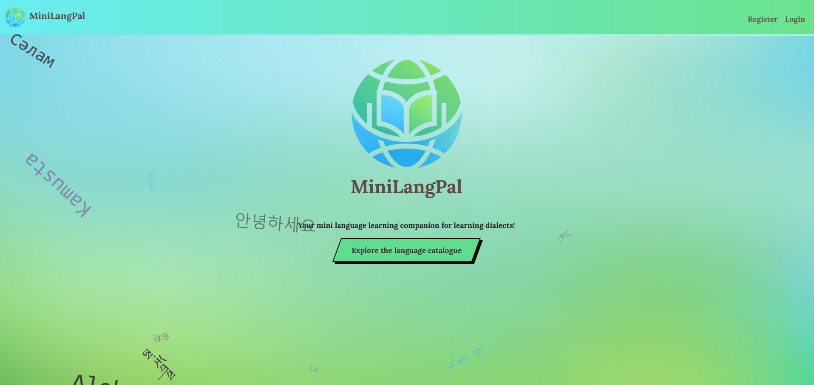
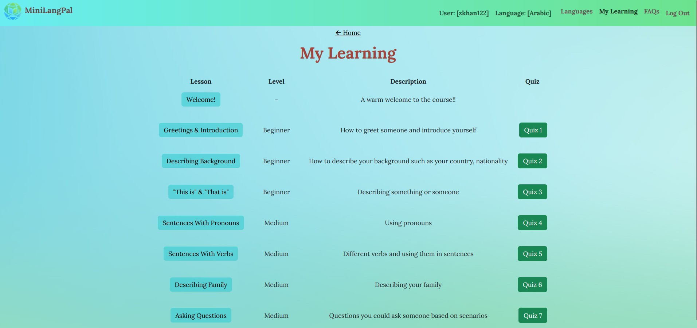
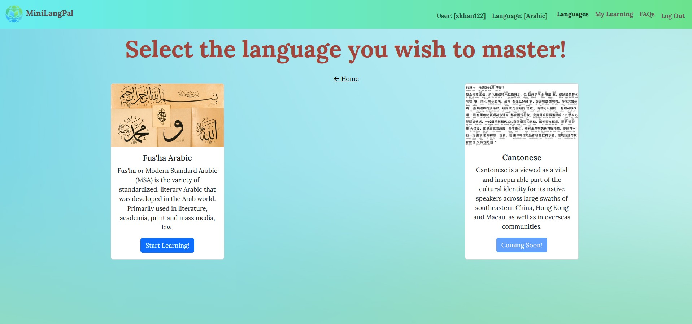
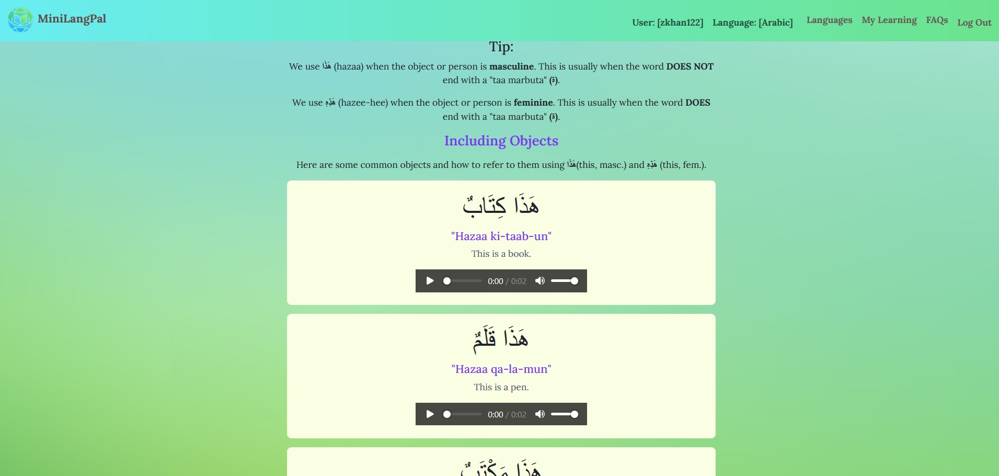

MiniLangPal was developed as a solution to be able to learn dialects or less known languages in a simpler way.

Current websites which teach dialects (taking Fus'ha Arabic as an example - Madinah Arabic is an example website) are highly detailed but lack retention functionality. This hinders the acceleration of being able to allow the brain to piece together what you have learnt in the past. We make use of **interactive quizzes** and have laid the content out in a **minimalistic** way as well as **synthesized AI audio playback**.

### Home Page

### Contents

### Language Hub

### Example of learning content

### Tech Stack:

- Backend: Java SpringBoot
- Frontend: ReactJS
- Database: MySQL
- Frameworks: Bootstrap, TailwindCSS
- Deployment: Docker multi-containerization + Railway

### Developers:

Zayaan Khan: Lead FullStack Developer (full time)

Rita San: Frontend Developer (part time)

### Development Time:
9 Months